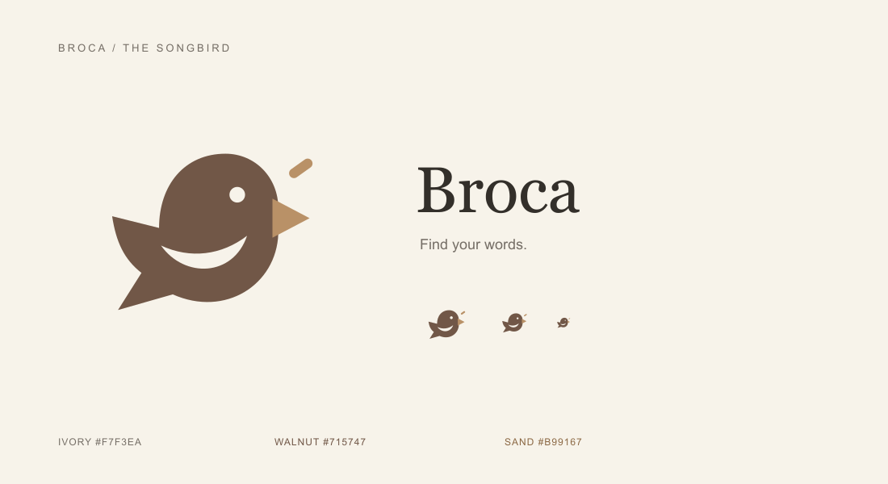

# Broca 品牌与图形标志

状态：名称已确定，用户已同意先采用当前鸣鸟 Logo。

## 名称

产品名为 **Broca**，取自与语言产出有关的 Broca's area，呼应从理解词义到主动表达的学习目标。侧栏、浏览器标签、桌面窗口、启动提示和 macOS 安装包统一使用该名称。

## Logo：鸣鸟

采用侧身鸣鸟的独立图形，不使用 EN 或 B 等字母变形。圆润的身体、留白翅膀与短鸣声线表达开口练习；尾部也带有对话气泡的轮廓感。Logo 不增加渐变、玻璃或阴影，确保缩小后仍可识别。

| 用途 | 颜色 |
| --- | --- |
| 身体轮廓 | 暖棕 `#715747` |
| 鸟喙、鸣声线 | 沙金 `#B99167` |
| 留白、应用图标底色 | 象牙白 `#F7F3EA` |

## 资源与接入

- `apps/web/public/broca-mark.svg`：透明背景的矢量主标志，两个侧栏入口共用。
- `apps/web/public/broca-icon.svg`：象牙色圆角底的浏览器图标。
- `apps/web/public/broca-touch-icon.png`：180 px 收藏图标。
- `apps/desktop/resources/broca-icon.png`：1024 px 桌面与 Dock 图标。
- `apps/desktop/resources/broca.icns`：含 16–1024 px 多分辨率的 macOS 安装包图标。
- `broca-brand-preview.svg` / `.png`：品牌与小尺寸展示稿。

SVG 是图形源文件。PNG 从同一 SVG 栅格化导出，ICNS 由 macOS `iconutil` 合成；修改标志时应同步重新导出这些资源。桌面开发脚本仍使用 `pnpm dev:desktop`，需要重新启动才能更新原生名称与 Dock 图标。

## 数据兼容

本轮更改展示品牌，数据路径继续使用 `~/Library/Application Support/EnPet/`，包括 SQLite、设置和 Chromium 用户目录。显式保留 Electron 的 userData 路径，避免 app.setName 改名后切换到空目录。

`ENPET_*` 环境变量、内部 `@enpet/*` 工作区包名、数据库名称、练习记录标记和 `com.enpet.app` 应用 ID 保持兼容。源码文件夹仍为 `en-play`。本轮没有迁移、清空或重写学习数据。
